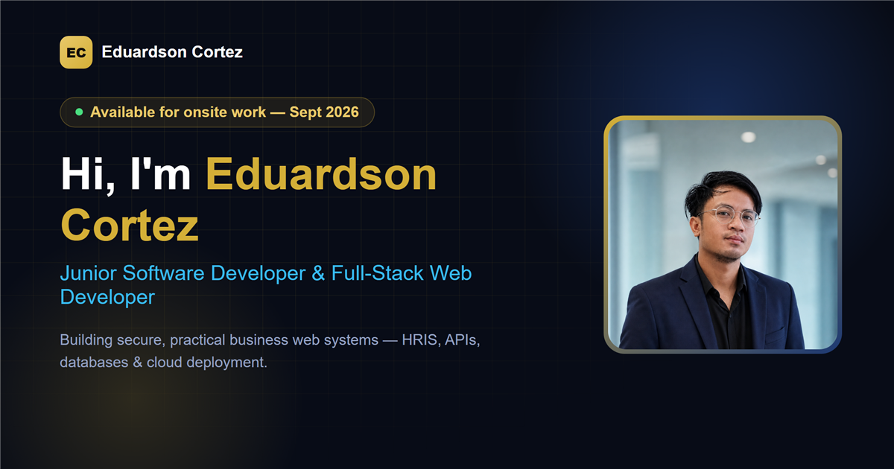

# Eduardson Cortez — Portfolio Website

Personal portfolio of Eduardson Cortez, a graduating BS Information Systems (Cybersecurity Track) student and aspiring Junior Software Developer / Junior Application Developer.

**Live site:** https://eduardpogi05.github.io/portfolio-website/



## About

A single-page portfolio covering background, technical skills, work experience, projects, development workflow, and education — built to support job applications for Junior Software Developer / Junior Application Developer roles.

## Technologies used

- HTML5, CSS3 (custom, no framework)
- Vanilla JavaScript (scroll spy, mobile nav, reveal animations)
- Self-contained inline SVG icon sprite (no external icon CDN)
- Google Fonts (Poppins, Inter)

## Project structure

```
Portfolio_Website/
├── index.html          # Main page
├── css/
│   └── style.css       # Styling (theme, layout, responsive rules)
├── js/
│   └── script.js       # Nav toggle, scroll spy, reveal animations
├── images/
│   ├── profile.png           # Hero photo
│   └── portfolio-preview.png # Social share preview image
└── docs/
    └── Eduardson_Cortez_Resume.pdf
```

## Deployment

This is a fully static site — no build step required. It's deployed via **GitHub Pages** from the `main` branch.

To run locally:

```bash
npx http-server -p 5500
```

Then open `http://localhost:5500`.

## Contact

- Email: eduardcortez05@gmail.com
- Website: https://siglatechsolutions.com/
- GitHub: https://github.com/eduardPogi05
